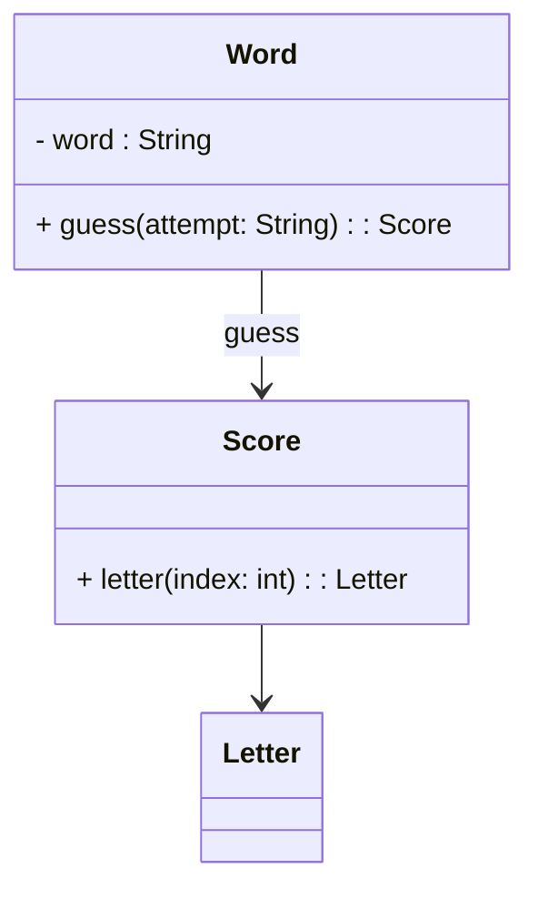

# VU Pauline Hesperides

## TP1 - Partie 2 etape 1 
### Find my word

Question 6 : 

Question 7 : "Quelle est la prochaine fonctionnalité que nous pouvons ajouter" ?
- La prochaine fonctionnalité que nous pouvons ajouter est de vérifier une lettre correcte.

Question 9 : * Pourquoi le test est-il fail ? * Quel est le code de production qu'il faut modifier pour passer à l'étape verte ?
- Pour faire passer ce test, nous devons modifier le comportement de la classe Word et de la classe Score pour gérer une lettre correcte.

